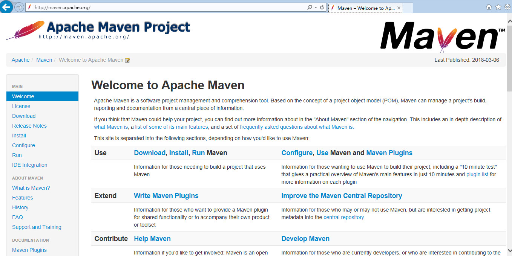
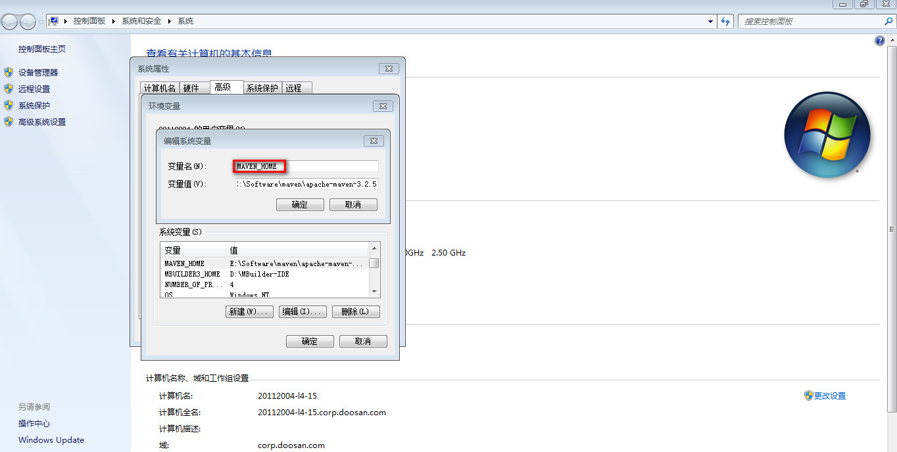
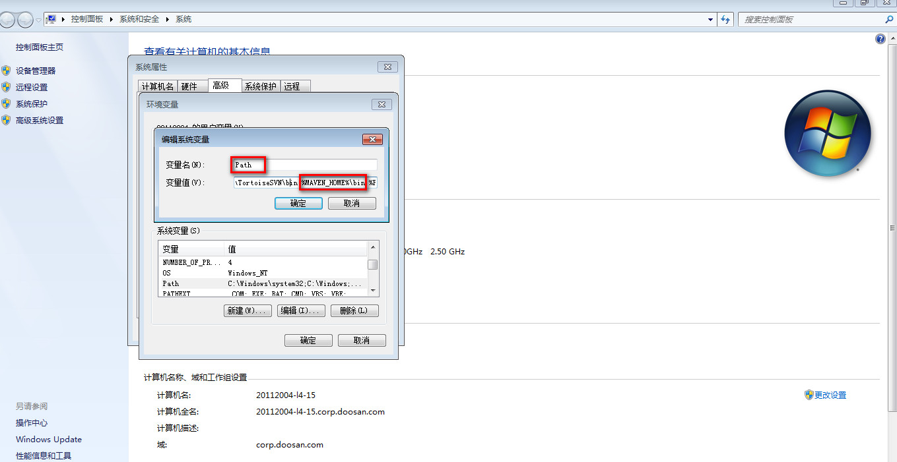
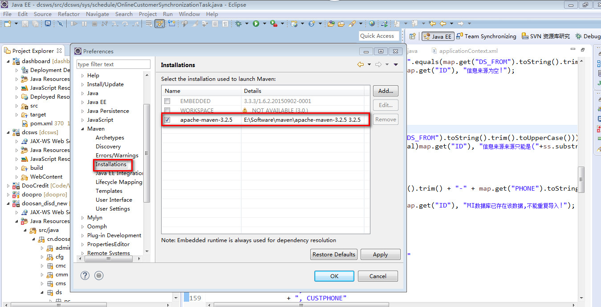
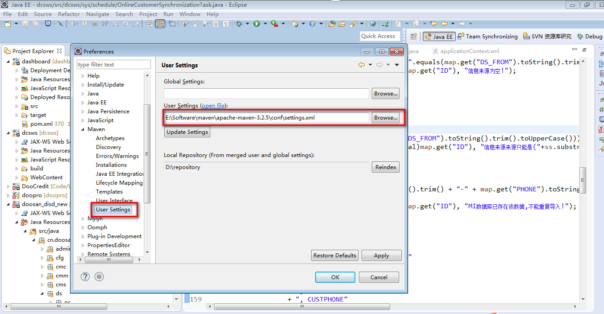

# Maven


# 1.[Maven仓库地址][maven]

# 2.加载本地jar包
- 1:首先将jar文件放到D盘下；
- 2:执行命令：
	mvn install:install-file -Dfile=wm-isclient.jar -DgroupId=doosan.eai.tool -DartifactId=eai.tool.modul -Dversion=1.0 -Dpackaging=jar
# 3.Maven下载
- [Apache Maven地址][apache]



- 解压后配置环境变量(Windows下):





- 修改conf下的setting.xml文件:

	解除localRepository注解，配置本地库路径。
	```xml
		<localRepository>D:\repository</localRepository>
	```
- 本地环境配置完毕

#4.Eclipse集成配置本地Maven

- 打开Eclipse,点击工具栏的Window,下拉菜单选择Preferences。

- 找到Maven,展开找到Installations，点击Add新增本地Maven,并勾选。



- 设置User Settings选项，选择本地setting.xml文件。



- Eclipse配置本地Maven完成

<!-- 链接地址 -->
[maven]:http://mvnrepository.com/
[apache]:http://maven.apache.org/
